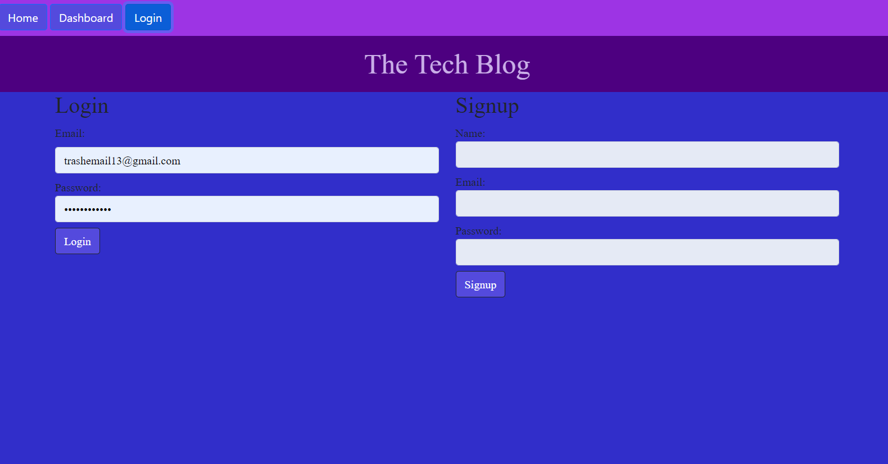
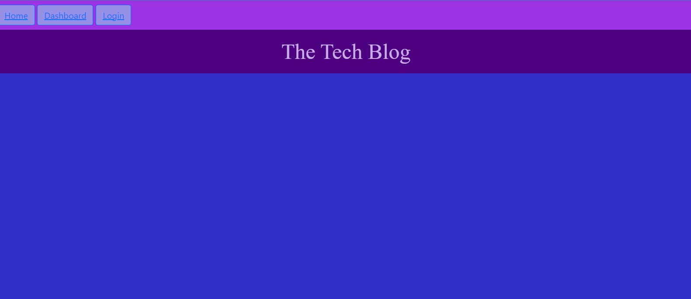
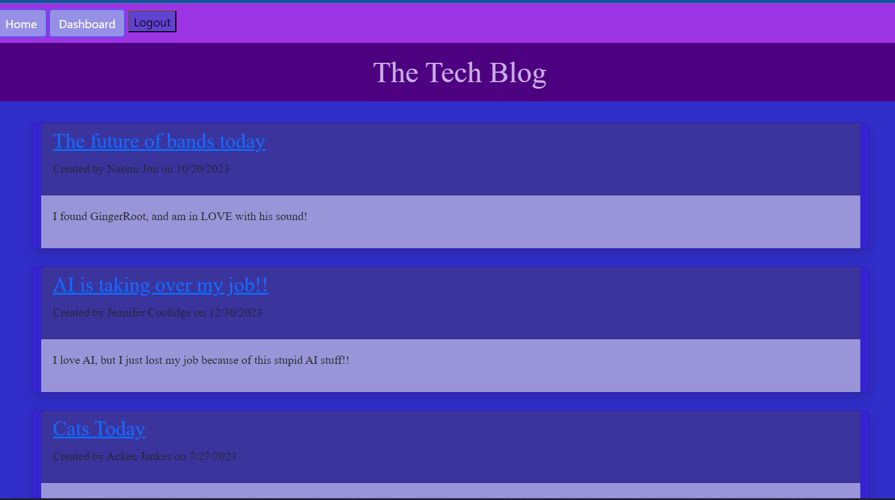

# Dev-thoughts-blog
Dev-Thoughts-Blog is a CMS-style tech blog built using the MVC paradigm. It provides a platform for developers to publish their insights, thoughts, and opinions on the latest technologies while fostering a community through interactive features like commenting and personalized dashboards.

## Table of Contents
- [Description](#description)
- [Screenshots](#screenshots)
- [Technologies Used](#technologies-used)
- [Installation](#installation)
- [Deployment](#deployment)
- [Contribution Guidelines](#contribution-guidelines)
- [License](#license)
- [Questions](#questions)

## Description
Crafted for users to engage with tech industry content, this full-stack application provides a platform for creating, storing, and interacting with posts. Users can seamlessly manage their content through the dashboard, comment on fellow users' posts, and edit or delete their own contributions. The homepage offers a preview of all current posts without requiring an account, directing users to login or create one when accessing the dashboard or specific posts. The application ensures security through user authentication using session storage, cookies, and bcrypt-hashed passwords stored in the MySQL database. Following a model-view-control (MVC) architecture, the project employs the Sequelize ORM dependency to link the front-end code to the database, integrates Express routing, and utilizes the handlebars templating engine for efficient data transfer. While facing challenges with the handlebars template engine in their first use, the developer navigated complexities to grant certain partials access to data. Overcoming initial struggles with routing and middleware syntax in their inaugural full-stack web application, the completion of the project marked a successful journey of mastering interconnected components.

### Screenshots
**Screenshots of application:**

## Technologies Used
This application is powered by Node.js (v16.19.1), Express.js (v.14.18.2), JavaScript, MySQL, Sequelize (ORM), and Handlebars (template engine). It utilizes the node package manager (npm) dependencies sequelize (v6.31.1), mysql2 (v3.3.0), express (v4.18.2), dotenv (v16.0.3), nodemon (v2.0.22), bcrypt (v.5.1.0), bootstrap (v5.2.3), connect-session-sequelize(v.7.1.6), express-handlebars (v7.0.7), and express-session (v1.17.3). Jest (v.29.5.0) is installed for future unit testing. Also, the Insomnia application was utilized to test the functionality of routes within the program.

## Installation
Clone the repo: git clone https://github.com/PotionSela/Dev-thoughts-blog

Open in VS Code. If you do not have VS code you must install it.

Using the terminal, install node.js v16.

Once node.js v16 is installed, in the terminal, utilize the command npm init -y to initialize and create a package.json where project files will be stored.

Next, use the terminal to run the command npm i to install the dependencies associated with this application.

Commands to install each dependency:
Command for sequelize will be npm i sequelize, the same will be for mysql2, express@4.18.2, dotenv, nodemon, bcrypt, connect-session-sequelize, express-handlebars, express-session, jest

Next, you will need to make sure you have an added .env file within the root directory of your repository, within which you will pass your environmental variables specifying the database name, your MySQL username, and your MySQL password. This will need to be completed before running the application, and will allow the connection.js file to utilize your environmental variables keeping your sensitive information protected.

If you do not have a MySQL account, you will need to create one (see https://dev.mysql.com/doc/mysql-installation-excerpt/5.7/en/).

Once all dependencies are installed, you will need to create the database. To do this you will need to navigate to the directory db directory containing the schema.sql file. Once there, you will need to open up a MySQL shell using the command mysql -u root -p, where you will then be prompted to enter you password. Once your password is entered you will be in the MySQL shell.

Once in the MySQL shell you will then run the command source schema.sql. This will create the database.

Once the database has been created, you will then need to seed the database (this will also create the model structure for the tables within the database). To do this, navigate to the root directory and run the command npm run seed. This needs to be done from the root directory because the .env file lives within the root.

Once the database has been seeded, you will then be able to run the command npm start from the root directory to spin up the server. With nodemon installed, you will also be able to utilize the command npm run watch to keep the server spun up between code edits.

From there, you can utilize applications such as Insomnia to test the functionality of the routes within the program and make edits to both the front-end and back-end of the code base.

## Deployment
If you want to checkout the live site, you can do that by clicking [here!](https://dev-thoughts-blog-2fbafcb43f14.herokuapp.com/)

## Contribution Guidelines
Open to collaboration. If you choose to do so, open an issue and modify any changes you would like to see on a feature branch and wait for approval before merging to the main branch.

## License
This application has no License.

## Questions
Have additional questions? [Contact me through my GitHub account](https://github.com/PotionSela) or email me at giselamata27@gmail.com.